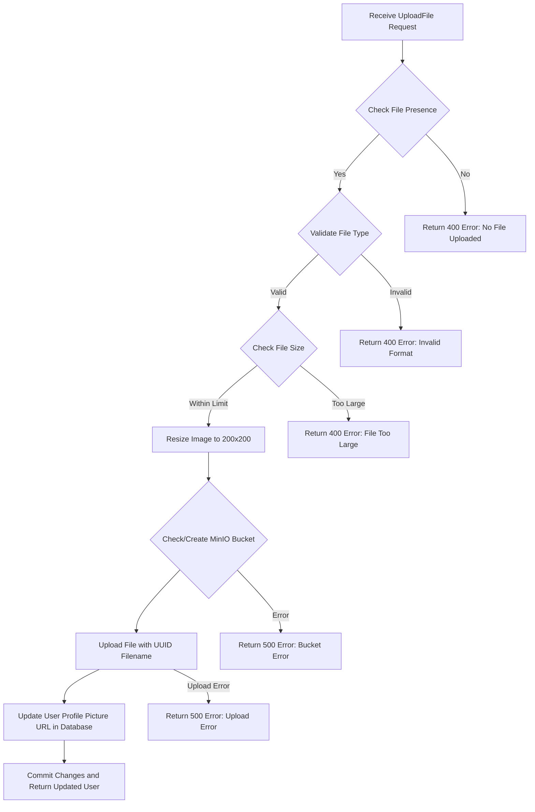

# Profile Picture Upload - MinIO Integration

## Overview

This module handles uploading a user's profile picture to a **MinIO** object storage system securely and efficiently.

The `/user/upload-profile-picture` endpoint allows authenticated users to upload a profile picture, ensuring:

- **File validation** (presence, type, and size),
- **Bucket management** (create if not exists),
- **Upload to MinIO** with a unique filename,
- **Database update** of the user's profile picture URL,
- **Robust error handling** with detailed logging.

---

## Key Features

### ✅ File Validations
- **Presence Check**: Ensures a file is uploaded.
- **Content-Type Validation**: Only allows:
  - `image/jpeg`
  - `image/png`
  - `image/gif`
- **Size Check**: Limits upload size (e.g., 5 MB). If exceeded, rejects the file.

### ✅ Image Processing
- Resizes the uploaded image to fit a **200x200** thumbnail using **PIL (Pillow)** for optimized storage and consistent display.

### ✅ MinIO Bucket Handling
- Verifies if the configured MinIO bucket exists.
- If not, **creates** the bucket automatically.
- Uploads the file under a **unique filename** (generated with `secrets.token_hex`).

### ✅ Database Update
- Updates the user's `profile_picture_url` field in the database.
- Commits and refreshes the user record.

### ✅ Error Handling
- Properly captures and logs:
  - Invalid file formats
  - Oversized files
  - Permission errors
  - File not found errors
  - Unexpected server-side errors
- Returns appropriate HTTP responses with descriptive error messages.

---

## File Upload Flow



---

## Future Improvements
- **Optimize bucket check**: Move bucket existence validation to application startup.
- **Optimize memory usage**: Avoid full `file.read()` for large files; consider streaming or chunked reads.
- **Delete old pictures**: Implement removal of old profile pictures when users upload a new one.
- **Configurable Settings**: Move file size limits and allowed content types to a config file/environment variables.

---

## Dependencies
- **FastAPI**
- **SQLAlchemy (AsyncSession)**
- **Pillow (PIL)** - for image resizing
- **MinIO Python SDK** (`minio`)
- **Logging** (Python `logging` module)

---

## Example Request

```bash
curl -X POST "http://yourdomain.com/user/upload-profile-picture" \
-H "Authorization: Bearer <your_token>" \
-H "Content-Type: multipart/form-data" \
-F "file=@/path/to/your/profile_picture.png"
```

---

## Notes
- Maximum supported file size is **5 MB** (can be increased).
- Uploaded images will be **resized** to **200x200 pixels** before uploading to MinIO.
- Only JPEG, PNG, and GIF formats are allowed.
- Each uploaded image will have a **unique name** to prevent overwriting.